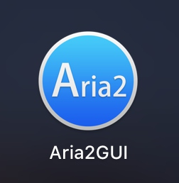

# Aria2 - 下载神器



实现百度，迅雷等离线下载。


## 安装 | Install 

```
$ brew install aria2
```

## 配置 | Settings
```
$ cd ~
$ mkdir .aria2
$ cd .aria2
$ touch aria2.conf
```

可以设置`aria2.conf`文件如下：
```
#用户名
#rpc-user=user
#密码
#rpc-passwd=passwd
#上面的认证方式不建议使用,建议使用下面的token方式
#设置加密的密钥
#rpc-secret=token
#允许rpc
enable-rpc=true
#允许所有来源, web界面跨域权限需要
rpc-allow-origin-all=true
#允许外部访问，false的话只监听本地端口
rpc-listen-all=true
#RPC端口, 仅当默认端口被占用时修改
#rpc-listen-port=6800
#最大同时下载数(任务数), 路由建议值: 3
max-concurrent-downloads=5
#断点续传
continue=true
#同服务器连接数
max-connection-per-server=5
#最小文件分片大小, 下载线程数上限取决于能分出多少片, 对于小文件重要
min-split-size=10M
#单文件最大线程数, 路由建议值: 5
split=10
#下载速度限制
max-overall-download-limit=0
#单文件速度限制
max-download-limit=0
#上传速度限制
max-overall-upload-limit=0
#单文件速度限制
max-upload-limit=0
#断开速度过慢的连接
#lowest-speed-limit=0
#验证用，需要1.16.1之后的release版本
#referer=*
#文件保存路径, 默认为当前启动位置
dir=/Users/xxx/Downloads
#文件缓存, 使用内置的文件缓存, 如果你不相信Linux内核文件缓存和磁盘内置缓存时使用, 需要1.16及以上版本
#disk-cache=0
#另一种Linux文件缓存方式, 使用前确保您使用的内核支持此选项, 需要1.15及以上版本(?)
#enable-mmap=true
#文件预分配, 能有效降低文件碎片, 提高磁盘性能. 缺点是预分配时间较长
#所需时间 none < falloc ? trunc « prealloc, falloc和trunc需要文件系统和内核支持
file-allocation=prealloc
```
- [配置示例下载](http://aria2c.com/archiver/aria2.conf)

默认下载路径的「/Users/xxx/Downloads」可以改为任何你想要的绝对路径。此处写为 Downloads 目录，xxx 请自行替换成你的 Mac 用户名，然后保存，退出编辑器。


#### 启动

```
$ aria2c --conf-path="/Users/xxxxxx/.aria2/aria2.conf" -D
```

#### 配置 Web 界面

```
$ git clone https://github.com/ziahamza/webui-aria2
```

#### 添加到收藏夹

```
$ cd webui-aria2 
$ open index.html
```
然后点击”收藏“按钮把这个页面添加到收藏夹里吧！

---

*参考：*

* [Aria2 源码/程序下载](https://sourceforge.net/projects/aria2/files/stable/)
* Mac下使用Aria2下载教程----迅雷和百度盘终极解决方案(可突破百度盘限速) - http://bbs.feng.com/read-htm-tid-9585996.html
* 在 OS X 里通过终端进行文件下载的利器：Aria2 - http://chaishiwei.com/blog/804.html
* MAC OS里的下载利器 — Aria2！- http://www.coderblog.in/2015/06/the-best-download-app-for-mac-os-aria2.html
* Mac 上使用百度网盘很烦躁？花点时间配置 aria2 吧 - http://sspai.com/32167
*