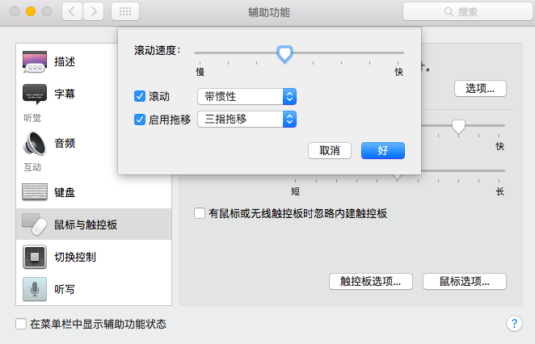

# 系统偏好设置

系统偏好大概是是所有设置的第一步，新装机的 Mac OS X 总有一些小的细节需要调整。一步一步跟着来吧: D。当然如果觉得麻烦，就直接忽略吧，以后也可以按照自己的喜好来慢慢调整。

## 键盘

### 按键重复

打开 “系统偏好设置 —— 键盘”。

把“按键重复”调至 “最快”，并把“重复前延迟”调制“短”或倒数第二格。

### 将 F1,F2 设置为标准功能键，而不是亮度调节键

### 自定义快捷键

* 若使用 Alfred，则可以关闭 spotlight 的快捷键。  
  默认为：**command + space**（可将其设为 Alfred 的快捷键）

### 设置输入源，输入法

* 安装自己喜欢的输入法。

  推荐使用 “[搜狗输入法](http://pinyin.sogou.com/mac/)”。[^1]

* 装机时应该已经设定好了一种输入源。若需要加入新的输入源请在此设置。若安装了输入法且没有启用也请在此设置。

## 触控板

#### 打开三指拖拽

进入在 “系统偏好设置 — “辅助功能” — “互动” — “鼠标与触控板” — “触控板选项” 。

打开“启用拖移”，选择“三指拖移”。

\*老版本 Mac OS X 系统就在 "触控板" 选项里面修改。

#### 打开轻按触摸

打开 “系统偏好设置 —— “触控板” —— “光标与点按”，勾选

## \*其他

### Dock

按照自己的喜好把 Dock 放在自己喜欢的位置吧。

### Finder

打开 Finder，在屏幕右上角选择“偏好设置”（command + , ）。

* 设置开启新的“Finder”窗口时，打开家目录（Home）。（默认开启"我的所有文件”让人很是困扰）
* 取消“我的所有文件”在侧边栏的显示。

### 顶部菜单栏

* 点击“电池图标”，选择“显示百分比”。

### 账户

* 设置 Calender，Mail，备忘录等等的同步账号。

---

[^1]：在本指南创作的时候，关于在 Mac 下使用什么的样的输入法最好，仍然没有一个定论。从使用上来讲，从2011年搜狗推出输入法到现在，搜狗输入法已经没有什么扰人的问题了。如果原先在 Win 下还有使用习惯的话，可以直接沿用。但是，关于搜狗输入法对隐私的尊重和保护方面，笔者也对其持怀疑态度。

